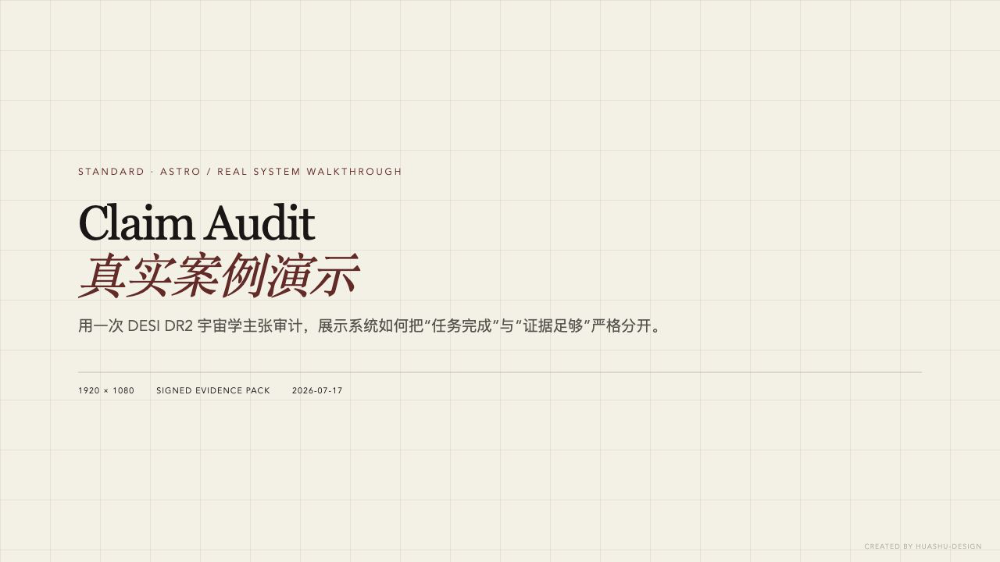

# Standard Astro

> 面向观测宇宙学的可审计 AI 研究工作台。<br>
> An auditable AI research workbench for observational cosmology.

**研究 Alpha / Research alpha · 仅限宇宙学 / Cosmology only**

## 项目 / What it is

Standard Astro 把宇宙学问题转成受控的资料检索、似然分析、拟合、核查和导出
流程。数值主张必须能追溯到本次运行的服务端证据、固定版本的数据、来源记录和
引用；证据不足时，系统应返回 `WITHHELD`（暂不支持结论）或
`CAPABILITY_GAP`（能力缺口），而不是猜测。

Standard Astro turns cosmology questions into controlled retrieval,
likelihood, fitting, audit, and export workflows. Numerical claims must trace
to current-run server evidence, versioned data, provenance, and citations.
Insufficient evidence must become `WITHHELD` or `CAPABILITY_GAP`, not a guess.

这不是“自动复现任意论文”的机器，也不能替代同行评议。<br>
This is not a “reproduce any paper” machine, and it does not replace peer review.

## 当前状态 / Current status

- **Daily 科学诚实门 / Daily honesty gates** — 代码和回归测试已加强；连续记录仍需
  真实定时运行来积累。 / Code and regression coverage are stronger, but
  consecutive evidence still requires real scheduled runs.
- **严格 DESI v1 复现 / Strict DESI v1 reproduction** — 仍为 `WITHHELD`；链、
  诊断和独立复算尚未形成完整可发布证据包。 / Still `WITHHELD`; the chains,
  diagnostics, and independent recomputation do not yet form a complete
  publishable evidence pack.
- **Claim Audit** — 后端、页面、私有 Evidence Pack、邀请和隐私流程正在集成验证。
  `CLAIM_AUDIT_ENABLED` 默认是 `false`；关闭时接口返回 404，不应视为生产功能。 /
  The backend, UI, private Evidence Pack, invitation, and privacy flows are
  under integration verification. The flag defaults to `false`; disabled
  endpoints return 404 and are not a production feature.
- **Workflow Foundry** — 能力缺口现在可以进入 AI 候选、隔离验证和可恢复的 Demo
  记录。候选始终是 `NON_FORMAL_DEMO`，不能被聊天模型或正式 Worker 调用，也不能
  输出 `SUPPORTED`；只有精确版本经过人工审核、签名构建和签名 Registry 发布后，
  才能成为正式工作流。全部 Foundry 开关默认关闭。 / Capability gaps can now enter
  AI drafting, isolated validation, and durable Demo records. Candidates remain
  `NON_FORMAL_DEMO`: neither the chat model nor a formal Worker can invoke them,
  and they cannot output `SUPPORTED`. An exact version becomes formal only after
  human review, a signed build, and a signed Registry release. All Foundry flags
  default to off.
- **DESI DR2 Matrix** — 只后处理操作员本地镜像中、经过 SHA-256 核验的官方外部
  链。单元属于 `published_external`；矩阵汇总始终是
  `publication_ready=false` 且 `__do_not_claim__=true`。共享 DESI/CMB 数据时不
  计算简单 tension σ。 / It post-processes only SHA-256-verified official
  external chains from an operator-supplied local mirror. Cells are
  `published_external`; the aggregate is always non-publication-ready and
  never computes a naive tension σ for analyses sharing DESI/CMB data.
- **Rubin / Euclid / Roman** — 目前只有 `SCHEMA_FIXTURE_ONLY`，不能在线执行，也
  不能支持测量结论。 / Schema fixtures only: not executable and not evidence
  for a measurement claim.

P0 尚未完成真实备份恢复、生产切换和连续 72 小时观察。P1 尚未完成启用前的连续
14 天 Daily 稳定记录及 28 天真实用户验证。准确表述是：**工程实现进行中；产品
验证尚未完成。** 即使 Claim Audit 给出 `SUPPORTED`，也不代表结论已经通过同行
评议。

P0 has not completed a real backup/restore, production cutover, and 72-hour
observation. P1 has not completed the required 14 consecutive Daily days or
28-day real-user validation. The accurate status is: **engineering in
progress; product validation pending.** `SUPPORTED` still does not mean “peer
reviewed.”

## 真实演示 / Real demo

[](./docs/demo/standard-astro-claim-audit-demo.mp4)

这段 32 秒分镜演示由一次真实本地运行的界面截图制作：输入一个 DESI DR2 动态暗能量强主张后，
任务状态为 `COMPLETED`，科学状态独立判定为 `CAPABILITY_GAP`。系统没有猜测
结论，同时生成并验签了 Evidence Pack。 / This 32-second storyboard demo is
made from UI captures of a real local run. The job completes, while the scientific verdict independently becomes
`CAPABILITY_GAP`, no result is guessed, and the signed Evidence Pack verifies.

[案例、限制与复现方法 / Case, limits, and rebuild instructions](./docs/demo/README.md)

希望帮助测试工作流工厂的宇宙学研究者，可以阅读
[20–30 分钟设计伙伴 Alpha 说明](./docs/alpha/FOUNDRY_DESIGN_PARTNER_BRIEF.md)。
托管生产服务尚未开放自助使用；测试采用预约式本地运行或引导式演示。 / Cosmology
researchers interested in testing the Workflow Foundry can read the
[20–30 minute design-partner Alpha brief](./docs/alpha/FOUNDRY_DESIGN_PARTNER_BRIEF.md).
The hosted service is not yet open for self-service use; tests are scheduled
local runs or guided walkthroughs.

## 本地启动 / Local start

需要 Python 3.11 和 Node.js 20+。以下命令用于新克隆的仓库。<br>
Requires Python 3.11 and Node.js 20+. These commands are for a fresh clone.

```bash
# 终端 1：后端 / Terminal 1: backend
cd backend
python3.11 -m venv venv
source venv/bin/activate
pip install --require-hashes -r requirements.lock
./venv/bin/uvicorn app.main:app --reload --port 8000
```

```bash
# 终端 2：前端 / Terminal 2: frontend
cd frontend
npm ci
npm run dev
```

打开 [应用 / app](http://localhost:5173/chat)、
[健康检查 / health](http://localhost:8000/health) 或
[API 文档 / docs](http://localhost:8000/docs)。本地默认使用 SQLite，可在 Account
页面配置自己的模型 API Key。完整异步任务和生产部署还需要 PostgreSQL、Redis、
Worker 及持久对象存储。

Local development defaults to SQLite; add your own model API key under
Account. Full asynchronous and production operation also requires PostgreSQL,
Redis, a worker, and durable object storage.

## 验证 / Verify

```bash
cd backend
./venv/bin/ruff check app tests
./venv/bin/pytest tests -q
```

```bash
cd frontend
npm run lint
npm run test
npm run build
```

## 文档 / Documentation

- [诚实证据与已知限制 / Honesty evidence and known limits](./docs/HONESTY_EVIDENCE.md)
- [架构 / Architecture](./ARCHITECTURE.md) · [来源映射 / Source mapping](./docs/SOURCE_MAPPING.md)
- [详细上手指南 / Detailed quick start](./docs/QUICKSTART.md)
- [部署 / Deployment](./DEPLOYMENT.md) · [生产切换清单 / Cutover checklist](./docs/PRODUCTION_CUTOVER_CHECKLIST.md)
- [隐私 / Privacy](./PRIVACY.md) · [安全 / Security](./SECURITY.md) · [数据许可证 / Data licences](./docs/DATA_LICENSES.md)
- [P0 + P1 完整路线图 / Complete P0 + P1 roadmap](./docs/roadmaps/P0_P1_COMPLETE_PLAN.zh-CN.md)
- [AI 科研工作流工厂 v1 / AI Workflow Foundry v1](./docs/roadmaps/AI_WORKFLOW_FOUNDRY_V1.zh-CN.md)
- [Workflow Foundry 发布与激活手册 / Release and activation runbook](./docs/runbooks/FOUNDRY_RELEASE_AND_ACTIVATION.zh-CN.md)
- [AI 候选代码落盘与合并手册 / Candidate source materialization](./docs/runbooks/FOUNDRY_SOURCE_MATERIALIZATION.zh-CN.md)

## 许可证 / Licence

项目源代码采用 [Apache License 2.0](./LICENSE)。数据、论文和第三方服务仍遵循
各自的许可证、引用和致谢要求；Apache-2.0 不会覆盖这些外部条款。贡献者还需
遵守 [DCO](./docs/DCO.md)。

Project source code is licensed under the [Apache License 2.0](./LICENSE).
Data, papers, and third-party services retain their own licence, citation, and
acknowledgement requirements; Apache-2.0 does not override those terms.
Contributions also follow the [DCO](./docs/DCO.md).
